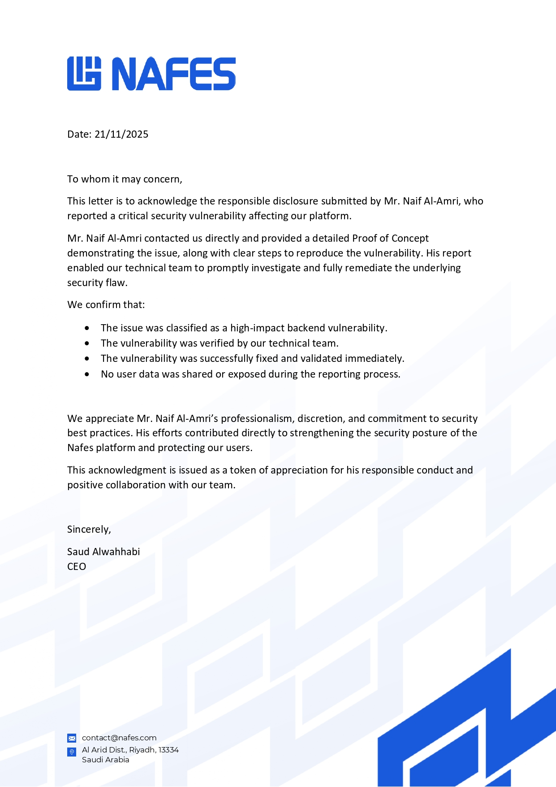

# Responsible Disclosure

You can find my **CVEs**, **vulnerabilities research**, and **responsible disclosures** here :)

## CVEs

| CVE ID | Project | Vulnerability Type | Severity | CVSS
|---|---|---|---|---|
| CVE-2026-47170 | **PROCESSING CVE** | Server-Side Request Forgery (SSRF) | **High** | 7.7
| CVE-2026-48527 | HaxCMS | Stored Cross-Site Scripting (XSS) Sanitizer Bypass | **High)** | 8.7

---
## Public References

[HaxCMS Stored Cross-Site Scripting (XSS) Security Advisory](https://github.com/advisories/GHSA-g2g8-95qg-v35h)

[HaxCMS Stored Cross-Site Scripting (XSS) cve.org](https://www.cve.org/CVERecord?id=CVE-2026-48527)

---
## Responsible disclosure - Nafes
- Discovered and responsibly disclosed a critical backend vulnerability (9.8 CVSS) that led to the exposure of sensitive user data, including Personally Identifiable Information (PII) which affected over 50,000 users and allowing full control of the API.

